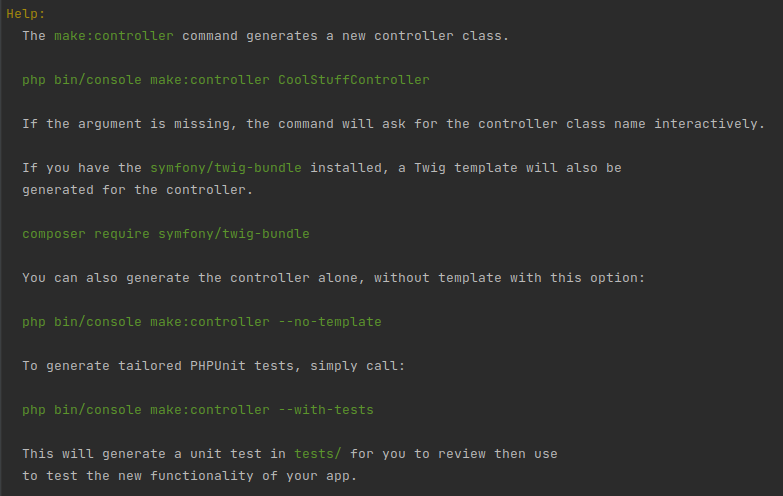
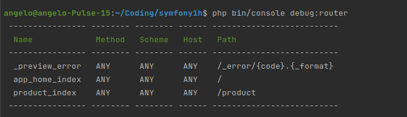

# SYMFONY PROJECT: php 8.3.26

## [thksTo](https://www.youtube.com/watch?v=i_jgWZItCGI&list=PLFbnPuoQkKsc5yjrpKZz9Zz9SBtoXHPlF)

## [Templates](https://symfony.com/doc/current/templates.html#installation)

## [Symfony Recipes Github](https://github.com/symfony/recipes/tree/main/symfony)

## [Symfony MakerBundle](https://symfony.com/bundles/SymfonyMakerBundle/current/index.html)

## [Routing](https://symfony.com/doc/current/routing.html)

## [Twig references](https://symfony.com/doc/current/reference/twig_reference.html)

## 

## [Databases and the Doctrine ORM](https://symfony.com/doc/current/doctrine.html)

## [Doctrine Attributes reference](https://www.doctrine-project.org/projects/doctrine-orm/en/3.5/reference/attributes-reference.html#attributes-reference)
